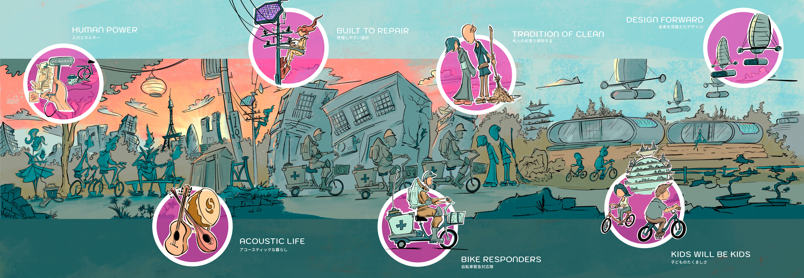

[Interactive Link](https://cycling-embassy.jp/solarpunk/2026/)

In this interactive artwork we explore how a city like Tokyo can strengthen its disaster resilience through community participation, with bicycles serving as a practical and accessible tool for post-disaster support.

The composition is structured as a timeline, illustrating a progression from present-day capabilities (left) to potential future innovations (right). It highlights existing resources such as mobile communication devices and conventional battery storage systems, while envisioning future developments including micro-renewable energy technologies, fleets of electric emergency-response bicycles, and rapidly deployable emergency shelters.

Together, these elements present a vision of a more resilient and self-sufficient community, demonstrating how citizens, technology, and local infrastructure can work together to support each other in the aftermath of a disaster.

