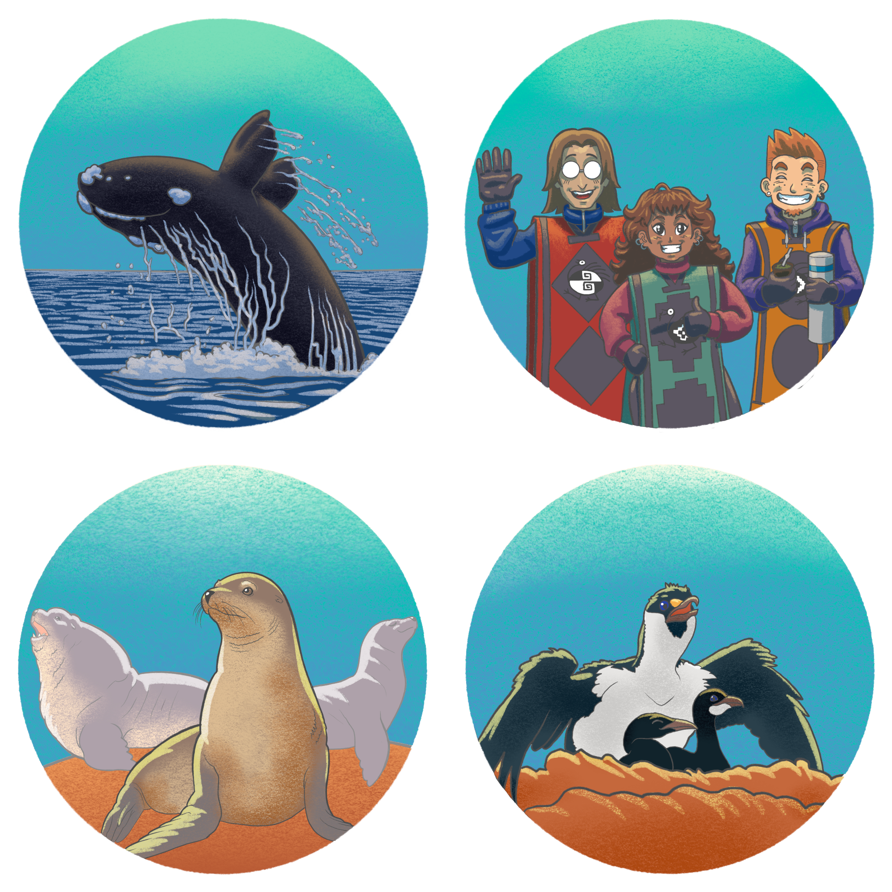
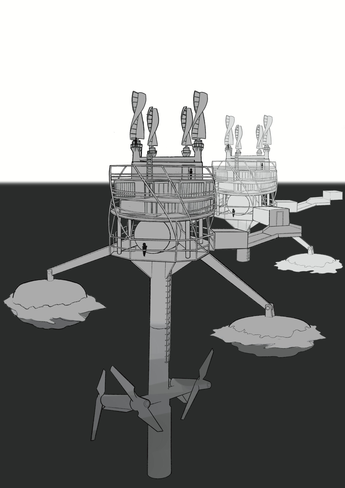

Kóoch Bridges is part of the Patagonian Sanctuary's vision. It imagines a near future where humanity has learned to inhabit the Southern Ocean with the intention of understanding and healing it. These marine platforms harness the energy of the tides, wind, and sunlight to support the towers where scientists, engineers, and local communities work together to restore the biodiversity of the South Atlantic.

Just a few decades earlier, penguins, sea lions, whales, cormorants, and countless other species populated these shores. The expansion of settlements built around oil extraction transformed much of the region into a hostile landscape for wildlife. The Kóoch Bridges were created as recovery infrastructure: generating clean energy, supporting marine research, and creating safe conditions for the return of species.

Life in these towers is characterized by fresh air, curiosity, and coexistence with the ocean. Their modular architecture (which recycles shipping containers) draws inspiration from the visual languages of the Aónikenk and Mapuche peoples, imagining a future with memory, one where Indigenous communities reclaim an active role in building a new relationship between society and the land.

