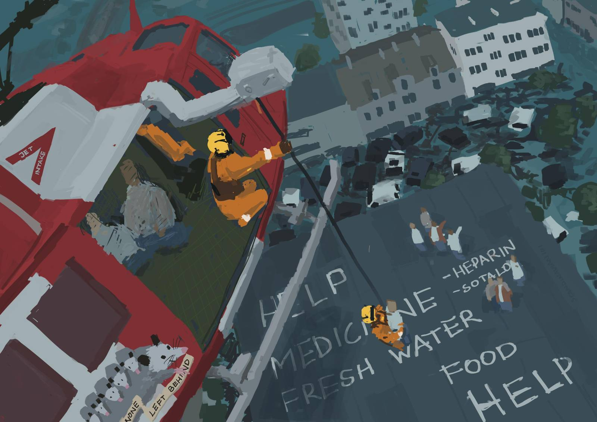

A rescue operation in the aftermath of a flood set in an unknown location, based on Indonesia. Originally an illustration for the [Fire Brigade](/seeds/the-fire-brigade/) Story Seed.

The perspective and composition done by Scan101, the clean lineart, characters and coloring by The Lemonaut. Scan's version used as a background for the [2026 Art Collab](/pages/andrewisms-art-collab-2026/) below:

